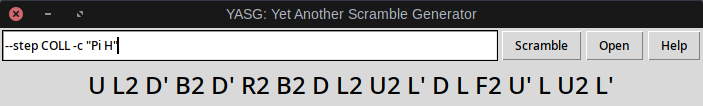

**YASG**: Yet Another Scramble Generator
-------------------




YASG is a program that can generate scramble algorithms for a variety of different methods and substeps to solve the Rubik's Cube. Its main selling point is its support for very specific custom scramble specifications.

The command line version of this program simply prints out a scramble and exits, which makes it highly suitable as a plug-in for building puzzle timers. The graphical version is mostly a wrapper for the command line program.

Feel free to contact me for any questions. My contact details are listed on my GitHub profile.

-----------------------------

Skip to sections

1. [Usage overview](#usage-overview)

2. [Installing and running](#installing-and-running-the-program)

3. [Custom scrambles by using options](#method-1-for-custom-scrambles-options)

4. [Custom scrambles by writing YASG files](#method-2-for-custom-scrambles-yasg-files)

## Usage Overview

There are three ways to generate scrambles:
1. Just run the program without any arguments to get a completely random state.
2. Use a variety of options (see below) to generate a case from a specific set. These options determine parameters such as the pieces that can be disoriented/permuted, the number of bad edges, a predefined step, etc.
3. Load a file written in the YASG language that contains instructions to generate a specific scramble type. This method is the most versatile and can be used for subsets of algorithm sets, such as dot OLL, CLS-0 or PLL with a diagonal swap.

And that's it. Tutorials for methods 2 and 3 can be found below.

## Installing and running the program

You need to have Python (version >= 3) installed to run this program. You also need the following Python libraries
- [kociemba](https://github.com/muodov/kociemba)

You can [install these with Pip](https://www.youtube.com/watch?v=jnpC_Ib_lbc).

Once you have everything installed, you can download this entire package and open the file ```yasg/yasg_gui.py``` with Python.
Run ```yasg/yasg_cli.py``` instead if you want to use the command line version.

## Method \#1 for custom scrambles: Options
The options are what you type in the text box if you want a custom scramble type.
If you use the command line version instead, you probably already know how they work.

Options consist of a word followed by an argument (usually). If the argument  consists of multiple words, you have to enclose it with quote marks `" ... "`.

Note that the order in which you use them *doesn't matter*. Using ```-x -y``` is the same as using ```-y -x```. If you want to specifiy the exact order in which certain operations are done, you would have to write a YASG file (see below).

A full list of options can be obtained by running the program with the ```-h``` or ```--help``` flag for the command line version, or by clicking the help button on the graphical version. A tutorial on how to use each of them is found below.

### ```-s```, ```--step```

This is by far the most useful flag.. Many substeps are supported, including, but not limited to, OLL, PLL, COLL, EPLL, SB, ZZF2L, LS, EJLS etc. Use "help" (`-h` flag or help button) for an exhaustive list.

<table><tr><td width=110px>


</td><td>

&nbsp; ```-s PLL``` or ```--step=PLL```

</td></tr></table>

<table><tr><td width=110px>


</td><td>

&nbsp; ```-s ZZLS``` or ```--step=ZZLS```

</td></tr></table>

<br>

### ```-p```, ```--permute ``` and ```-o```, ```--disorient```

Specify the corners and edges that can be disoriented or permuted. This exists just in case any substep isn't supported yet. You can either specify specific pieces or an entire layer. The syntax is ```-p "corners | edges"``` (or something other than ```-p```).

If you don't use this option, any piece may be disoriented or permuted, unless you also use another option that disorients or permutes pieces.
If you use the option, but leave the field for the corners (or edges) blank, none of the corners (or edges, respectively) will be disoriented or permuted.
You can also write ```all``` as a shorthand for all corners or all edges.

Note that there is not guarantee that these pieces **will** be disoriented or permuted. All that is known is that they **could** be.


_ZZ Last Slot scrambler (same as ```--step ZZLS```)_
<table><tr><td width=110px>


</td><td>

&nbsp; ```--disorient "U DFR | " --permute "U DFR | U FR"```

This disorients the corners in the U layer and the DFR corner, but it doesn't disorient any of the edges. It permutes the U-layer and DFR corners and the FR edge.

</td></tr></table>


_F2L scrambler (same as ```--step F2L```)_
<table><tr><td width=110px>


</td><td>

&nbsp; ```--permute "all | U FR FL BR BL" --disorient "all | U FR FL BR BL"```.

This is basically the same spiel. Note that you can group the U layer edges as "U" but you can't group the E-layer edges as E.

</td></tr></table>


<br>

### &nbsp; ```-c```, ```--ocll```

This forces a specific corner case for the last layer. You can enter a single OCLL case or a list in quotation marks, in which case it will choose one randomly. The names of these OCLL cases are U, T, L, H, Pi (or Bruno), S (or Sune), and AS (or Antisune). You should probably use this in combination with other options such as ```-s COLL```. Think of it as generating a scramble and twisting the corners at the end.


<table><tr><td width=110px>


</td><td>

&nbsp; ```-s CMLL -c "H Pi"```

or equivalently

&nbsp; ```-step CMLL -ocll "H Pi"```

</td></tr></table>


<br>

### ```-e```, ```--badedges```

This is made specifically with ZZ users in mind. It generates a scramble with an exact number of bad edges.

<table><tr><td width=110px>


</td><td>

&nbsp; ```-e 12``` or ```--badedges 12```

</td></tr></table>


<br>

### ```-a```, ```--auf```

This applies a random AUF at the end if it is not already included in options like ```--step``` or ```--permute```. Pretty self-explanatory.

<br>

### ```--pre```/```--premoves```, ```--post```/```--postmoves```

This produces that a scramble that is equivalent to doing the premoves, then applying the scramble as defined by the other options, and then applying the postmoves.

_Winter Variation scrambler (same as ```--step WV```)_
<table><tr><td width=110px>


</td><td>

&nbsp; ```--step OCLL --post "R U R'" --auf```

</td></tr></table>

<br>

### ```-f```, ```--file```

This generates a scramble as specified by a given YASG file. Make sure to type the entire file name and path to the file. Writing YASG files is a whole section in and of itself, but it is very similar to using options.


## Method \#2 for custom scrambles: YASG files

YASG files are a slightly more complicated, but also more versatile, method for generating custom scrambles. They can do everything you can do with options, in addition to

1. Specifying the order in which operations are performed (e.g. orient first, then permute)
2. Choosing randomly between different commands (e.g. doing A 50% of the time and B the other 50% of the time)

YASG files are programs you can write in a simple text editor like Notepad or vim. They are what sets YASG apart from other scramblers. You can specify the cube state at such a granular level that virtually every subset of a subset of cases can be programmed in YASG.

The following YASG program illustrates this. It generates ZZLL cases with a Pi corner orientation and one of two corner permutation cases.
```
# permute two adjacent corners with a T perm
moves R U R' U' R' F R2 U' R' U' R U R' F'

[
# Do a U2 AUF. In this case it will be a cross COLL
moves U2
OR
# Do nothing. In this case it will be a bars COLL
]

ocll Pi

AUF
# permute the edges, but keep them phased
[
moves R' U' R2 U R U R' U' R U R U' R U' R' # this is a Z perm
OR
moves R2 U2 R U2 R2 U2 R2 U2 R U2 R2 # H perm
OR
# do nothing
]
AUF
```
Other example programs can be found in the ```examples``` folder.

As you can see, it is basically a very simplified programming language. Every line is either
- a command with a similar effect as one of the options
- a comment to clarifies to the reader what a line of code does (starting with ```#```)
- a special token to define a list of alternatives

### Commands
Every command is the counterpart of one of the options. Commands are not case-sensitive, but options are. Use this table as a reference.

| Command |Option |
|-----------|-------|
| ```step```    | ```--step``` ```-s```  |
| ```permute```   | ```--permute``` ```-p``` |
| ```disorient``` | ```--disorient``` ```-o``` |
| ```moves```     | ```--pre```/```--premoves``` or ```--post```/```--postmoves``` |
| ```ocll```      | ```--ocll``` ```-c``` |
| ```auf```   | ```--auf``` ```-a``` |
| ```file```      | ```--file``` ```-f```  |
| ```badedges```  | ```--badedges``` ```-e``` |

While options would be applied in a fixed order, the order in which commands are executed is defined by the author of the file. Obviously, the program is executed from top to bottom.

Sometimes the order matters quite a bit. In particular, using ```step PLL``` doesn't always mean you get a PLL case after using it. It just applies the inverse of a random PLL algorithm to the cube.

### Listing alternatives
If you want to choose randomly between options A<sub>1</sub>, A<sub>2</sub>, ... A<sub>n</sub>, you can write.
```
[
A1
OR
A2
OR
...
OR
An
]
```
This should make a program that generates each A<sub>i</sub> exactly one n'th of the time. These A<sub>i</sub>'s can consist of an arbitrary number of lines (including zero), as long as there separated by ```OR``` lines.

### Using YASG files
You execute as YASG program by running YASG with the ```-f``` or ```--file``` option or by clicking the file button. If you want, you could call a YASG program within another YASG program.
